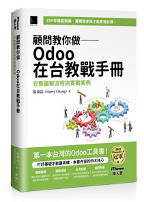

# 顧問教你做 Odoo 在台教戰手冊：完整圖解流程與實戰案例

## 📖 關於本書

本書專為台灣企業與使用者量身打造，內容涵蓋 **2023 年至 2024 年**的主流版本 **Odoo 17**。透過完整的圖解流程與實戰案例，帶領讀者深入淺出地掌握 Odoo 的核心功能與應用技巧，是您導入與學習 Odoo 的最佳指南。

## 🚀 Odoo 版本更新與發布說明

Odoo 保持著每年年底發布新版本的慣例，持續帶來更強大的功能與優化的用戶體驗。為了服務廣大讀者與 Odoo 使用者，本 Repository 將持續整理並更新 Odoo 各大版本的發布重點與新功能摘要，協助您快速掌握最新趨勢。

以下為各版本的更新重點整理：

### [📂 Odoo 17 版本更新摘要](./ODOO17版本更新清單.md)
*   **重點特色**: 全新 UI 設計 (深色模式)、PWA 支援、WhatsApp 整合、Shop Floor 現場工作站、Kiosk 自助點餐。
*   **適用期間**: 2023 - 2024

### [📂 Odoo 18 版本更新摘要](./ODOO18版本更新清單.md)
*   **重點特色**: 佣金計畫、產品組合銷售、網站搬家工具、甘特圖增強、發票異常偵測。
*   **預計發布**: 2024 年底

### [📂 Odoo 19 版本更新摘要](./ODOO19版本更新清單.md)
*   **重點特色**: AI Agent 深度整合、免費版分析預算、庫存 MPS 預測增強、會計庫存計價重大變革 (SVL 整併)。
*   **預計發布**: 2025 年底

---
*本專案將持續跟進 Odoo 官方最新消息，為您提供第一手的版本更新資訊。*
